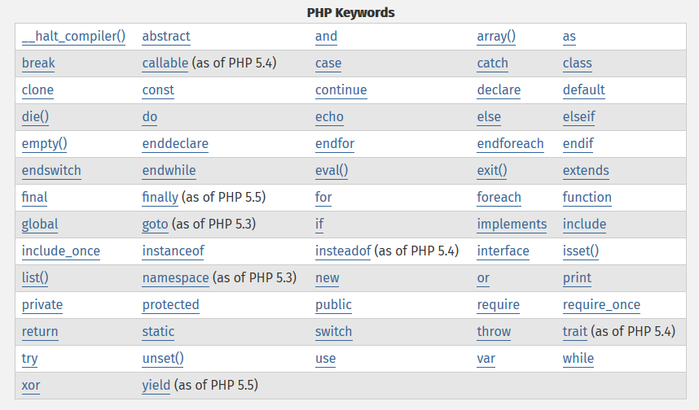
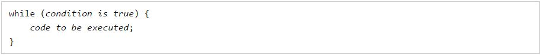
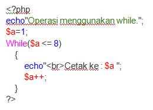
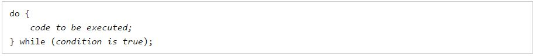
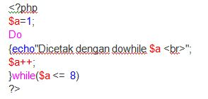
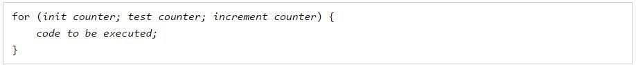
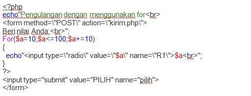

# **PHP**
***

## **A. Keyword PHP**

**1. While => Perulangan while banyak digunakan pada program yang terstruktur. Perulangan ini banyak digunakan bila jumlah perulangannya belum diketahui.    
Proses perulangan akan terus berlanjut selama kondisinya bernilai benar (true) dan akan berhenti bila kondisinya bernilai salah atau batas yang ditentukan telah terpenuhi.**

### *Syntax*

###*Implementasi*
   
   
**2.Do...While => Digunakan untuk menjalankan suatu pernyataan lalu diuji apakah kondisi sudah bernilai benar, tapi jika bernilai salah maka pernyataan tidak dijalankan. Pada dasarnya perulangan do...while sama saja dengan perulangan while, hanya saja pada proses perulangan dengan while, seleksi berada di while yang letaknya di atas sementara pada perulangan do...while, seleksi while berada di bawah batas perulangan. Jadi dengan menggunakan struktur do...while sekurang-kurangnya akan terjadi satu kali perulangan.**

### *Syntax*

###*Implementasi*

**3.For => Merupakan salah satu bentuk fungsi perulangan, digunakan untuk melaksanakan pernyataan berulang kali terhadap sejumlah nilai yang telah ditetapkan (jumlah putaran harus ditetapkan terllebih dahulu).**	

###*Syntax*

### *Implementasi*

**4.Foreach => Merupakan perintah yang melakukan aksi perulangan data kondisi array yang telah dimasukkan ke dalam variabel yang sudah kita buat.**

### *Syntax*

###*Implementasi*

**5.Array => Suatu struktur data yang dapat menyimpan banyak nilai dalam sebuah variabel.Tipe data array dapat menyimpan satu atau lebih data dalam variabel tunggal, sesuai dengan fungsinya, tipe data array sangat berguna untuk menyimpan banyak data dalam satu variabel.**

### *Syntax*

###*Implementasi*

**6.Break => Berfungsi sebagai perintah kepada web server untuk menghentikan  perulangan secara premature,yaitu menghentikan perulangan diluar dari yang direncanakan.. Fungsi break dalam php digunakan untuk menghentikan proses yang dilakukan oleh perintah php  : for, foreach, while, do-while atau switch.**

### *Syntax*

###*Implementasi*

**7.Continue => Berfungsi untuk menghentikan perulangan untuk 1 iterasi saja kemudian proses berikutnya akan dilanjutkan.**

### *Syntax*

###*Implementasi*

**8.If => Digunakan untuk mengeksekusi beberapa kode hanya jika kondisi tertentu adalah benar..**

### *Syntax*

###*Implementasi*

**9.If...Else => Digunakan untuk mengeksekusi beberapa kode jika kondisi benar dan kode lain jika kondisi salah.**

### *Syntax*

###*Implementasi*

**10.If...Elseif...Else => Digunakan untuk memilih salah satu dari banyak blok kode yang akan dieksekusi.**

### *Syntax*

###*Implementasi*

**11.Switch => Sebuah stuktur percabangan yang akan memeriksa suatu variabel, lalu menjalankan perintah-perintah yang sesuai dengan kondisi yang mungkin terjadi untuk variabel tersebut.**

### *Syntax*

###*Implementasi*

**12.Echo => Berfungsi untuk menampilkan satu atau lebih data string kedalam internet browser.**

### *Syntax*

###*Implementasi*

**13.Print => Fungsi print memiliki fungsi yang sama dengan echo, namun print hanya mampu menampilkan data tunggal (hanya satu data).**

### *Syntax*

###*Implementasi*

**14.Function => Yaitu kode program yang dirancang untuk menyelesaikan sebuah tugas tertentu, dan  merupakan bagian dari program utama. Kita dapat membuat  
fungsi sendiri, atau menggunakan fungsi yang dibuat oleh programmer lain.
Argumen fungsi ditulis dalam  tanda kurung dan dapat berupa tipe data 
apapun baik string, array, object,boelan, dsb.., selain itu argumen juga dapat 
dikosongkan.**

### *Syntax*

###*Implementasi*

**15.Class => Definisi kelas dasar dimulai dengan kata kunci kelas, diikuti oleh nama kelas, diikuti oleh sepasang kurung kurawal yang menyertakan definisi properti dan metode yang termasuk dalam kelas.**

###*Implementasi*

**16.Public => Ketika suatu property ataupun method dinyatakan public maka akan berlaku property ataupun method tersebut dapat diakses dari luar class dan dapat diakses oleh class turunan.**

###*Implementasi*

**17.Private => Ketika sebuah property atau method dinyatakan private maka tidak dapat diakses diluar class dan tidak dapat diakses oleh class turunan.**

###*Implementasi*

**18.Protected => Berbeda dengan public, protected hanya memperbolehkan suatu property atau method yang dinyatakan protected diakses hanya di dalam class tersebut dan class turunannya.**

###*Implementasi*

**19.Static => Jika kita mendeklarasikan function atau variable sebagai static berarti kita tidak perlu membuat instance untuk mengakses function atau variable 
tersebut.Karena metode statis dapat dipanggil tanpa turunan dari objek yang dibuat, variabel pseudo-$ ini tidak tersedia di dalam metode yang dinyatakan statis.**

###*Implementasi*

**20.Return => Perintah khusus untuk fungsi, dimana kata return menginstruksikan kepada PHP bahwa pemrosesan fungsi telah selesai.**

### *Syntax*

###*Implementasi*

**21.Extends => Yaitu syntax yang digunakan untuk membuat pewarisan sifat pada class (inheritance).**

###*Implementasi*

**22.Try   => Program yang akan dijalankan dan akan ditangkap eksepsinya jika terjadi kesalahan.**

**23.Catch => Berfungsi untuk melihat apakah function yang dieksekusi terjadi kesalahan atau error atau tidak. jika terjadi kesalahan maka akan di catch.Dan  catch akan  menunjukan error yang ingin kita beritahukan.**

###*Implementasi*

**24.Include => Perintah ini digunakan untuk menggabungkan suatu script PHP atau file dengan script pemanggilnya. Perintah include() akan memanggil selalu 
 akan melakukan evaluasi kembali script yang ada yang dispesifikasikan dalam perintah tersebut.**
 
 ### *Syntax*

###*Implementasi*

**25.Require => Perintah ini digunakan untuk menggabungkan suatu script PHP atau teks dari file lain dengan script PHP yang memanggilnya. Script atau file  
yang digabung tidak harus berisi script atau kode program PHP. Apabila script atau file yang digabungkan itu berupa script PHP, maka PHP akan mengevaluasi dan menjalankannya.**
 
 ### *Syntax*

###*Implementasi*

**26.Require_once => Pada prinsipnya require_once() sama dengan require() akan tetapi perbedaannya adalah dengan menggunakan require_once(), maka jika terjadi duplikasi nama atau pemanggilan suatu nama fungsi dapat dihindari. PHP dapat dipaksa untuk menggunakan nama fungsi yangtelah ada sebelumnya pada include() atau require() yang pertama.**
 
###*Implementasi*

**Apabila kita menjalankan file_b.php, maka akan terjadi error seperti gambar di bawah ini.**

**Error tersebut disebabkan oleh duplikasi nama fungsi, yang mana kita menyertakan file_a.php sebanyak dua kali. Untuk menghindari error di atas kita harus mengganti perintah require() menjadi require_once(). Sehingga script PHP pada file_b.php seperti di bawah ini.**

**27.Isset => Digunakan untuk menyatakan variabel yang sudah diset ataupun tidak. Jika variabel sudah diset maka variavel akan mengembalikan nilai true, sebaliknya akan bernilai false.**

### *Syntax*

###*Implementasi*

**28.Unset => Merupakan kebalikan dari isset(), yaitu untuk meng-unsetvariabel,dan membebaskan memory yang sudah digunakan dan juga berguna untuk menghapus sebuah variable.**

### *Syntax*

###*Implementasi*

**29.And => Akan menghasilkan nilai benar jika kedua kondisi pembanding bernilai benar,dan akan bernilai salah jika salah satu pembanding bernilai salah / nol.**

###*Implementasi*

**30.Or => OR akan menghasilkan nilai benar jika kedua kondisi pembanding bernilai benar, juga akan bernilai benar meskipun salah satu pembanding bernilai benar / satu.**

###*Implementasi*

